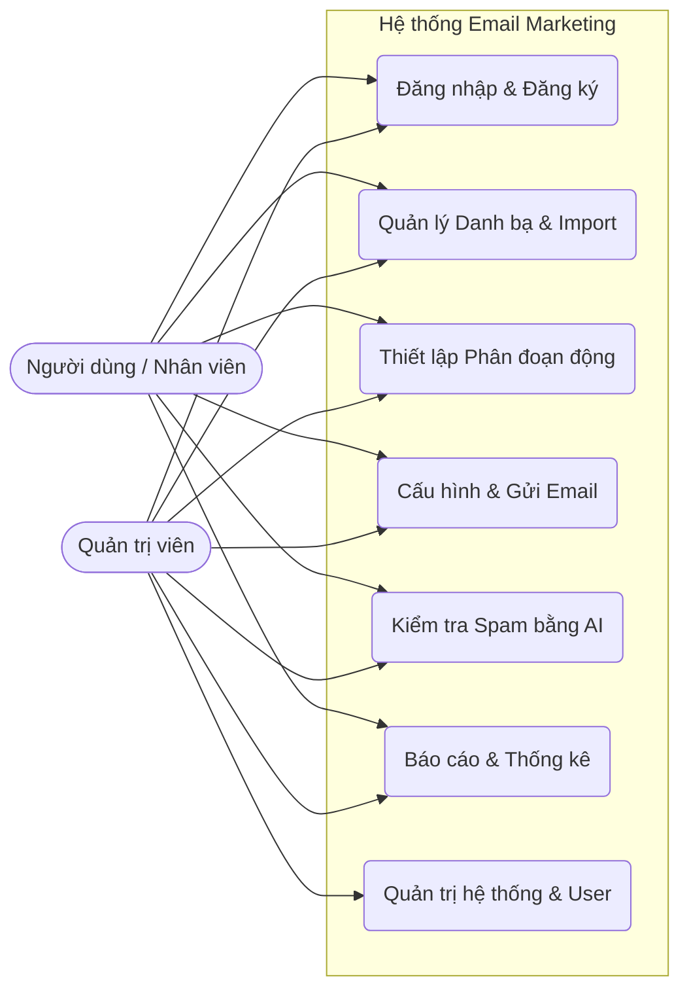
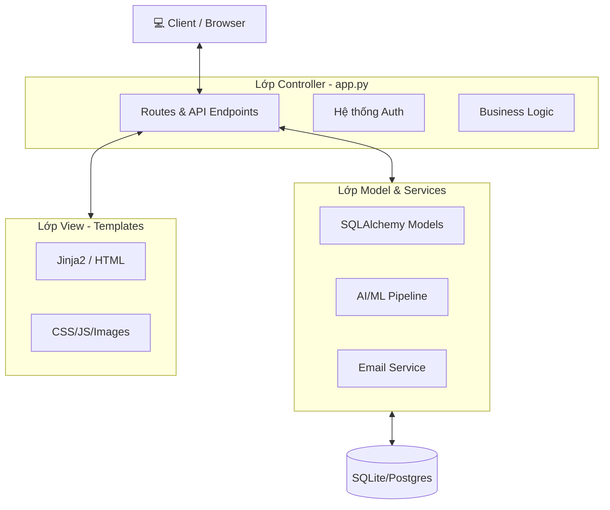
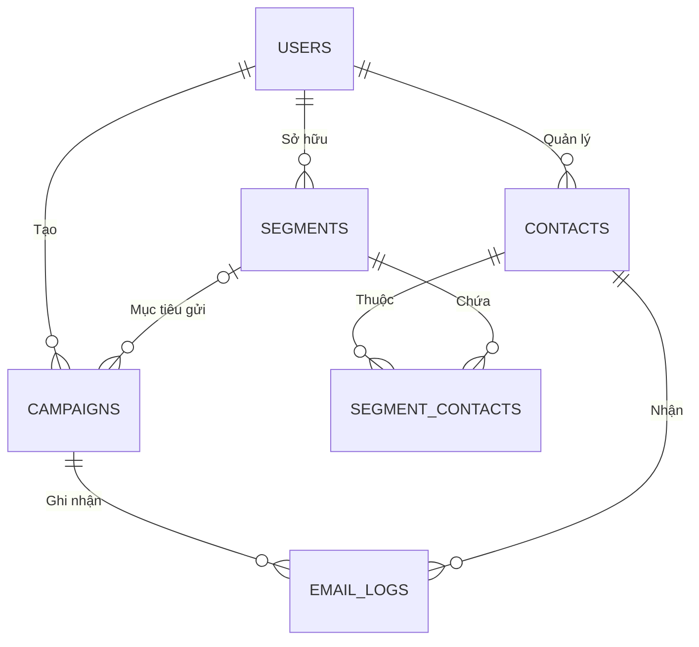

# 📧 Email Marketing System với Tích hợp AI (AI-Powered Spam Check)

**Đơn vị thực hiện:** Nhóm 01-D21: CNPM-01 Học viện Công nghệ Bưu chính Viễn thông (PTIT)

Hệ thống Quản lý Email Marketing hiện đại được xây dựng để tối ưu hóa quy trình gửi thư hàng loạt, quản lý khách hàng theo phân đoạn thông minh và phân tích nội dung thư rác bằng trí tuệ nhân tạo. Hệ thống được thiết kế theo kiến trúc chuẩn **MVC**, sử dụng **Python (Flask)** cho Backend và giao diện **Premium Modern UI** cho Frontend.

---

## 📸 1. Giao diện & Trực quan (Overview)

Hệ thống cung cấp trải nghiệm người dùng cao cấp với phong cách thiết kế Glassmorphism và Dashboard thống kê thời gian thực.

### Bảng điều khiển (Dashboard)
Hiển thị tổng quan số liệu về liên hệ, chiến dịch, và tăng trưởng danh sách khách hàng thông qua biểu đồ trực quan.

### Các tính năng chính:
- **Quản lý danh bạ & Import**: Hỗ trợ nhập hàng loạt từ file CSV/Excel.
- **Phân đoạn thông minh (Segmentation)**: Lọc khách hàng theo điều kiện động (Công ty, Tên, Trạng thái).
- **Soạn thảo Email & AI Assistant**: Tích hợp Google Gemini AI để soạn thảo nội dung và trình xem trước (Preview) thời gian thực.
- **Đặt lịch gửi (Scheduling)**: Tự động gửi email vào thời điểm đã định thông qua Background Task.
- **Kiểm tra Spam bằng AI**: Phân tích khả năng vào mục spam của email trước khi gửi.

---

## 🧩 2. Kiến trúc Hệ thống (Architecture)

### 2.1. Biểu đồ Use Case
Mô tả các chức năng chính của người dùng và quản trị viên.



### 2.2. Kiến trúc MVC (Model-View-Controller)
Sự phân tách rõ ràng giữa các lớp giúp hệ thống dễ dàng mở rộng.



### 2.3. Sơ đồ Cơ sở dữ liệu (ERD)
Cấu trúc dữ liệu quan hệ cho quản lý chiến dịch và liên hệ.



---

## 🧪 3. Trí tuệ Nhân tạo & Xử lý Dữ liệu (AI/ML)

Hệ thống tích hợp bộ lọc Spam dựa trên Machine Learning với quy trình xử lý chuyên sâu:

1.  **Tiền xử lý văn bản (Preprocessing)**: Sử dụng `TextCleaner` để chuẩn hóa, loại bỏ ký tự rác và áp dụng **SnowballStemmer** để đưa từ về gốc (Stemming).
2.  **Kỹ thuật đặc trưng (Feature Engineering)**:
    *   **TF-IDF Vectorization**: Chuyển đổi văn bản thành tập vector số học.
    *   **Custom Features**: Trích xuất các thuộc tính như độ dài văn bản, số lượng chữ số, sự hiện diện của URL và ký hiệu tiền tệ ($ £ €).
3.  **Mô hình dự đoán (Model Ensemble)**: Cho phép so sánh giữa 5 thuật toán chính:
    *   **Random Forest (RF)**
    *   **Logistic Regression (LR)**
    *   **Support Vector Machine (SVM)**
    *   **Decision Tree (DT)**
    *   **K-Nearest Neighbors (KNN)**

---

## 🛠️ 4. Công nghệ Sử dụng (Tech Stack)

### Backend
- **Framework**: Flask 2.3.3
- **ORM**: SQLAlchemy (Flask-SQLAlchemy 3.0.5)
- **Auth**: Flask-Login 0.6.2
- **Scheduler**: APScheduler 3.10.4 (Chạy ngầm gửi thư)
- **AI Integration**: Google Generative AI (Gemini 2.0) cho soạn thảo nội dung.

### Frontend
- **Framework**: Bootstrap 5.3.0 & Bootstrap Icons 1.11.3
- **Templates**: Jinja2 (HTML5/CSS3/JS)
- **Styling**: Premium Glassmorphism UI, Animate.css
- **Editor**: Custom HTML Editor với Preview thời gian thực.

### Data & ML
- **Analysis**: Scikit-learn, Pandas, Numpy, NLTK
- **Visualization**: Matplotlib (Vẽ biểu đồ độ chính xác)
- **Format**: Openpyxl (Xử lý file Excel)

---

## 🚀 5. Hướng dẫn Cài đặt & Triển khai

### Bước 1: Khởi tạo môi trường
```bash
python -m venv venv
venv\Scripts\activate  # Windows
source venv/bin/activate  # macOS/Linux
```

### Bước 2: Cài đặt thư viện
```bash
pip install -r requirements.txt
```

### Bước 3: Cấu hình biến môi trường
Tạo file `.env` tại thư mục gốc:
```env
SECRET_KEY=chuoi_bao_mat_cua_ban
DATABASE_URL=sqlite:///email_system.db
SMTP_SERVER=smtp.gmail.com
SMTP_PORT=587
SMTP_USER=email@gmail.com
SMTP_PASS=mat_khau_ung_dung_gmail
GEMINI_API_KEY=your_gemini_api_key
```

### Bước 4: Huấn luyện mô hình AI
```bash
python train_model.py
```

### Bước 5: Khởi động hệ thống
```bash
python app.py
```
Hệ thống sẽ chạy tại: `http://127.0.0.1:5000`

---

## 📂 6. Cấu trúc Thư mục Dự án
```text
email_system/
├── app.py              # File chạy chính của ứng dụng Flask
├── models.py           # Định nghĩa cấu trúc Database (ORM Models)
├── email_service.py    # Logic gửi email và xử lý SMTP
├── ml_pipeline.py      # Định nghĩa Pipeline xử lý văn bản AI
├── train_model.py      # Script huấn luyện và đánh giá mô hình ML
├── instance/           # Chứa file cơ sở dữ liệu SQLite
├── models/             # Lưu trữ các file model AI (.pkl)
├── static/             # Assets (CSS, JS, Hình ảnh, Logo)
├── templates/          # Giao diện HTML (Jinja2)
├── scripts/            # Các công cụ quản trị (Manage users, v.v.)
└── requirements.txt    # Danh sách các thư viện cần thiết
```

---

## ⚖️ 7. Bản quyền & Tác giả
Dự án được thực hiện phục vụ mục đích nghiên cứu và học thuật tại **Học viện Công nghệ Bưu chính Viễn thông (PTIT)**. Mọi hành vi sao chép vui lòng trích dẫn nguồn đầy đủ.
